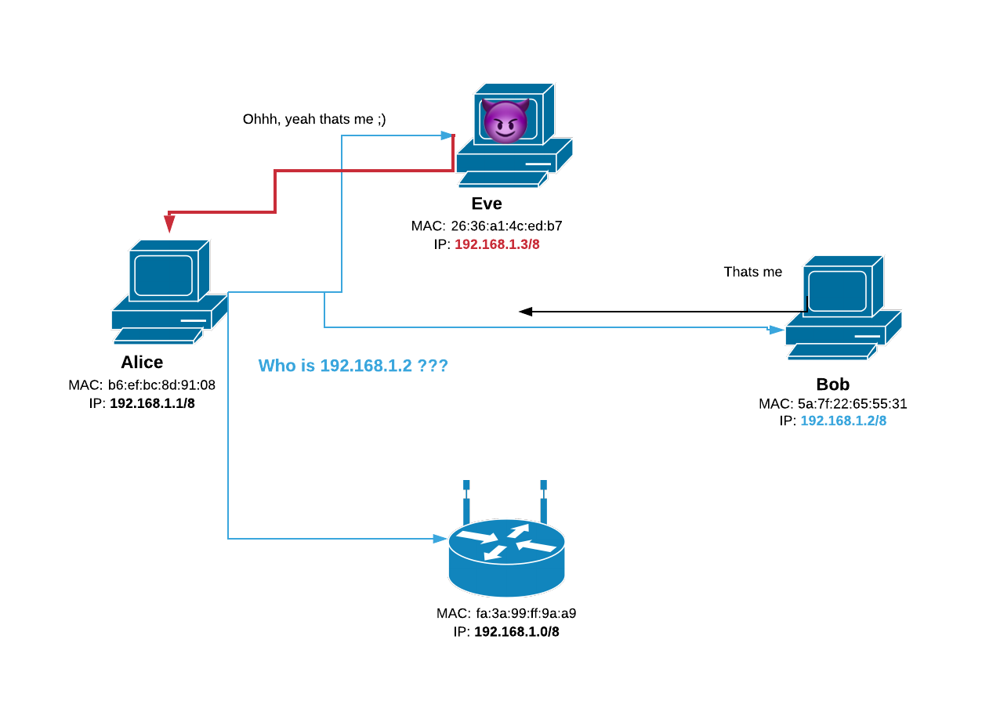

Once connected to a network, a hacker/penetration tester starts by discovering devices connected to the same network. This is the first part of the information gathering phase in every network pentesting assessment.<br>
There several ways to scan a network, for example, a technique like **ping sweep** is used to send ICMP echo request packets to every device and get responses from connected devices. Sometimes, this method is not reliable enough, as some devices running a firewall may not respond depending on the firewall rules. On the other hand, performing an **ARP scan** is more reliable as all devices must respond to ARP packets even the ones that are running firewalls, otherwise they cannot communicate with any other machine. In this article, we explain what is the ARP and how can we use it to discover devices in a network. As always, we will be implementing the whole thing in python.

### [](#header-3) What is ARP ?
ARP stands for address resolution protocol. This protocol is used to find the MAC address of the device corresponding to its IP address. This protocol aims to create communication between two devices on a local area network (Ethernet) by providing the other device's MAC address. To establish communication between two devices, the source device needs to generate the ARP request message. 

<p align="center">
  <br>
  <em>ARP protocol</em>
</p>
When a new computer joins a local area network (LAN), it will receive a unique IP address to use for identification and communication. <br>
Packets of data arrive at a gateway, destined for a particular host machine. The gateway, or the piece of hardware on a network that allows data to flow from one network to another, asks the ARP program to find a MAC address that matches the IP address. The ARP cache keeps a list of each IP address and its matching MAC address. The ARP cache is dynamic, but users on a network can also configure a static ARP table containing IP addresses and MAC addresses.<br>
In our case, we will use ARP to broadcast a request to the entire network. Devices that are connected to the same network must respond with ARP response.

### [](#header-3) What is a Scapy?
To perform an ARP scan, we need to forge our own packets from scratch, so we can send ARP request to the whole network. To do so, there is no better than the powerful scapy framework. Scapy is able to forge or decode packets of a wide number of protocols, send them on the wire, capture them, match requests and replies, and much more.
Scapy mainly does two things: sending packets and receiving answers. You define a set of packets, it sends them, receives answers, matches requests with answers and returns a list of packet couples (request, answer) and a list of unmatched packets.

### [](#header-3) Let’s code
The python script we are going to code is pretty simple to write yet it is a good introduction to scapy as we will use it often in the series **Pwn The Network** articles.<br> We use our script as follows: `python3 arp-scanner.py --network <net_addr>/<subnet_prefix>`

<p align="center">
  <br>
  <em>ARP protocol</em>
</p>

We will only need the `scapy` and `argparse` libraries to parse the network address we want to scan.<br>
To install scapy, use `pip install scapy`
```python
import scapy.all as scapy
import argparse
```
In the `scan()` function, we construct the ARP request layer by layer. First, we define the ARP layer and we provide the network address to scan (`pdst=ip`).<br>
Next we add an Ether layer with `dst='ff:ff:ff:ff:ff:ff'`, this layer is needed to broadcast our request to the entire network ("ff:ff:ff:ff:ff:ff" is the MAC address used for broadcast). We concatenate the two layers using `/` character. <br>Finally, we send the request using `srp` method that will return the received. 

```python
def scan(ip):
    arp_request = scapy.ARP(pdst=ip)
    broadcast = scapy.Ether(dst='ff:ff:ff:ff:ff:ff')
    arp_request_broadcast = broadcast/arp_request
    answered_list= scapy.srp(arp_request_broadcast,timeout=1,verbose=False)[0]
    return answered_list
```
The next step is to identify the MAC vendor of each device discovered. This can be achieved by comparing the first 3 octets of the MAC address of each device to an already existing database (The first 3 octets in a MAC address represent Organizationally Unique Identifier). In our case we can simply use a text file containing a large number of identifiers and their corresponding vendor.

```python
def get_mac_vendor(mac):
    mac = mac.upper().replace(':','')[0:6]
    with open("mac-vendor.txt","r") as f:
        for line in f :
            if mac in line:
                return line[7:]
    return 'Unknown'
```

Finally, we put the two functions together to nicely output the ip address of each connected device with its corresponding MAC address and vendor.

```python
def main():
    parser = argparse.ArgumentParser()
    parser.add_argument('-n','--network', type=str, required=True)
    args = parser.parse_args()
    hosts = scan(args.network)
    for host in hosts:
        mac_vendor = get_mac_vendor(host[1].src).strip()
        print(host[0].pdst + 2*'\t' + host[1].src + 2*'\t' + mac_vendor)

if __name__ == "__main__":
    main()
```
### [](#header-3) Conclusion
A good understanding of ARP is necessary of every hacker/penetration tester interested in network hacking. It is used to conduct MITM attacks to intercept network traffic and perform even more sophisticated attacks.<br>
Full code is available on [github](https://github.com/Ahmed-Z/arp-scanner). <br>
HAPPY HACKING.