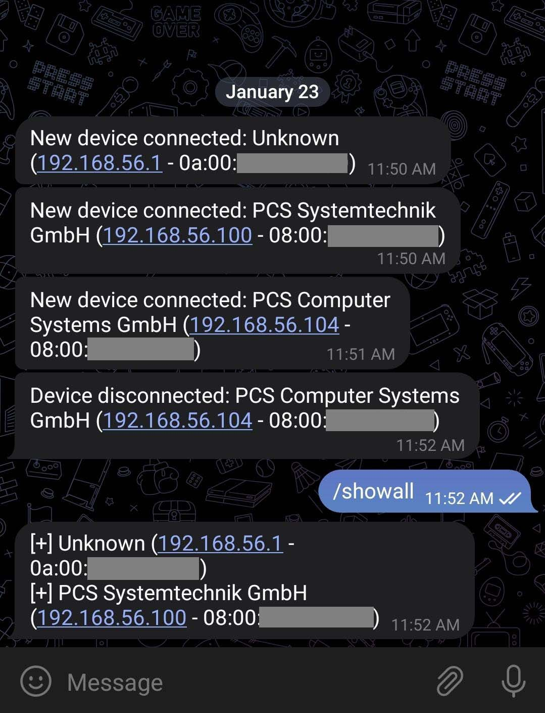

This script uses Telegram to notify you about the devices connected to your network. When you run the script, it starts a Telegram bot that you can interact with. The bot allows you to start the network scan and get a list of all currently connected devices on your network. You can receive notifications about new devices connected or disconnected on your network through Telegram, that way you can keep track of all the devices that are connected to your network wherever you are. The script makes it easy to monitor your network, you can receive notifications on your phone or computer and take actions if needed. 

<p align="center">
  
</p>

### [](#header-3) Create your config file
In the folder of the project you need to create the `conf.json` file that will contain some imporatant informations used in the script. 
```js
{
    "TOKEN": YOUR_TELEGRAM_TOKEN,   //str
    "CHAT_ID": YOUR_USER_CHAT_ID,   //str
    "NETWORK": NETWORK_TO_MONITOR,  //str: "192.168.1.0/24"
    "INTERVAL": SCAN_NETWORK_INTERVAL  //int: 60
}
```
### [](#header-3) Download and install Npcap
To be able to scan the network, the scapy library needs a dependency to be installed called Npcap

Installing Npcap on Linux:

1. Download the Npcap package for Linux from the Npcap website.
2. Open a terminal and navigate to the directory where the Npcap package is located.
3. Use the command sudo dpkg -i npcap-version.deb to install the package, replacing "version" with the version number of the package you downloaded.
4. Use the command sudo apt-get install -f to install any missing dependencies.
5. Once the installation is complete, use the command sudo ldconfig to update the library cache.


Installing Npcap on Windows:

1. Download the Npcap installer for Windows from the Npcap website.
2. Run the installer, and click on "Next" to begin the installation process.
3. Select the "Npcap" and "WinPcap compatibility" options.
4. Read and accept the license agreement.
5. Choose the installation location, and click on "Next" to continue.
6. Click on "Install" to begin the installation process.
7. Once the installation is complete, click on "Finish" to close the installer.


### [](#header-3) Getting your API key and your chat ID
Creating a Telegram bot using BotFather is a simple process. Here are the steps to create a Telegram bot using BotFather:

1. Open Telegram and search for @BotFather.
2. Start a chat with BotFather by clicking on the search result.
3. Send the command '/newbot' to BotFather to create a new bot.
4. BotFather will ask you to choose a name for your bot. Pick a name that you like and send it to BotFather.
5. BotFather will then ask you to choose a username for your bot. The username must end in "bot" (e.g., mynewbot) and should be unique.
6. Once you have chosen a username, BotFather will give you a token. This token is used to authenticate your bot with the Telegram servers. Keep this token safe, as you will need it later.

In order to get your Telegram chat ID, you will need to do the following:

1. Start a chat with the bot @RawDataBot.
2. Send the command /start to the bot.
3. The bot should respond with your Telegram informations. Grab the chat ID that you need.

Send the command /start to the bot.
### [](#header-3) Script overview
This Python script utilizes the Scapy library to scan a network for connected devices and the Telegram bot API to send notifications when a new device is connected or disconnected. The script also uses the macvendors.com API and a local file to determine the vendor of a device based on its MAC address.

The script begins by defining several functions:


- The `get_mac_vendor` function takes in a MAC address as a string and returns the vendor of that address. If the vendor cannot be determined, the function returns 'Unknown'.
- The `start_command` function scans the network and sends a message to the Telegram bot when a new device is connected or disconnected.
- The `showall_command` function sends a message to the Telegram bot with the connected devices.
- The `error` function prints the update and error message if an error occurs in the Telegram bot.
- The `start_bot` function starts the Telegram bot and sets up the command handlers.


### [](#header-3) Let's code
```python
from scapy.all import *
from telegram.ext import *
import json
import time
import requests
```
```python
def get_mac_vendor(mac):
    """
    This function takes in a MAC address as a string and returns the vendor of that address.
    If the vendor cannot be determined, the function returns 'Unknown'.
    :param mac: the mac address in question
    :return: the vendor name or 'Unknown' if not found
    """
    url = "https://api.macvendors.com/" + mac
    r = requests.get(url)
    # Check if the API call is successful (status code 200)
    if r.status_code == 200:
        return r.text
    # format the mac address
    mac = mac.upper().replace(':', '')[0:6]
    try:
        # open the local file to search for the mac address
        with open("mac-vendor.txt", "r", encoding='utf-8') as f:
            for line in f:
                if mac in line:
                    # return the vendor name after the mac address in the file
                    return line[7:]
    except FileNotFoundError:
        exit("Error: mac-vendor.txt file not found.")
    # if mac address is not found in the file or file not found
    return 'Unknown'
```

The `get_mac_vendor` function is a key component of the script, as it is used to determine the vendor of a device based on its MAC address. The function takes in a MAC address as a string and returns the vendor of that address.

The function first makes an API call to macvendors.com using the `requests` library, passing in the MAC address in question as a parameter. The API call returns the vendor name as a string, and the function returns this string if the API call is successful (status code 200).

If the API call is not successful, the function then formats the MAC address by converting it to uppercase and removing the colons. The function then opens a local file called `mac-vendor.txt` and searches for the MAC address in question. If the MAC address is found in the file, the function returns the vendor name that appears after the MAC address in the file.

If the MAC address is not found in the file or the file is not found, the function returns 'Unknown'. This indicates that the vendor of the device could not be determined.

The `get_mac_vendor` function is a crucial component of the script as it helps identify the different devices connected to the network, it allows to know who the device belongs to and can be useful in identifying unknown devices on the network.

```python
def start_command(update, context):
    """
    This function scans the network and sends a message to the Telegram bot when a new device is connected or disconnected.
    :param update: update object for the Telegram bot
    :param context: context object for the Telegram bot
    """
    connected_hosts = {}
    old_hosts = []
    while True:
        # scan the network
        ans, _ = arping(NETWORK, verbose=0)
        hosts = [host[1].src for host in ans]
        # check for new or updated devices
        for host in ans:
            mac_address = host[1].src
            mac_vendor = get_mac_vendor(mac_address).strip()
            ip_address = host[1].psrc
            if mac_address not in connected_hosts:
                msg = "New device connected: {} ({} - {})".format(
                    mac_vendor, ip_address, mac_address)
                context.bot.send_message(chat_id=CHAT_ID, text=msg)
            connected_hosts[mac_address] = (mac_vendor, ip_address)
        # check for disconnected devices
        for mac_address in old_hosts:
            if mac_address not in hosts:
                mac_vendor, ip_address = connected_hosts[mac_address]
                msg = "Device disconnected: {} ({} - {})".format(
                    mac_vendor, ip_address, mac_address)
                context.bot.send_message(chat_id=CHAT_ID, text=msg)
                del connected_hosts[mac_address]
        old_hosts = hosts
        time.sleep(INTERVAL)

```
The `start_command` function is responsible for periodically scanning the network and sending notifications to a Telegram bot when a new device is connected or disconnected. This function is executed when the `start` command is sent to the Telegram bot.

The function starts by initializing two dictionaries, `connected_hosts` and `old_hosts`, and enters an infinite loop.

In each iteration of the loop, the function uses the Scapy library's `arping` function to scan the network specified by the constant `NETWORK` and store the hosts in a list. It then compares the list of current hosts to the `old_hosts` list, which contains the previously connected hosts.

For each new or updated host in the current list, the function retrieves the vendor information by calling the `get_mac_vendor` function, passing in the host's MAC address as a parameter. The function then sends a message to the Telegram bot with the following format: "New device connected: [vendor name] ([IP address] - [MAC address])".

For each host in the `old_hosts` list that is no longer in the current list, the function sends a message to the Telegram bot with the following format: "Device disconnected: [vendor name] ([IP address] - [MAC address])".

After sending the notifications, the function updates the `old_hosts` list with the current list of hosts and waits for `INTERVAL` seconds before beginning the next iteration of the loop.

This function is the core of the script, it scans the network periodically and sends notifications to Telegram about the new and disconnected devices. The function also uses the get_mac_vendor function to identify the vendors of the devices. This allows the user to know which devices are connected to the network and who they belong to.

```python
def showall_command(update, context):
    """
    This function sends a message to the Telegram bot with the connected devices.
    :param update: update object for the Telegram bot
    :param context: context object for the Telegram bot
    """
    msg = ""
    ans, _ = arping(NETWORK, verbose=0)
    # check for new or updated devices
    for host in ans:
        mac_address = host[1].src
        mac_vendor = get_mac_vendor(mac_address).strip()
        ip_address = host[1].psrc
        msg += "[+] {} ({} - {})\n".format(mac_vendor, ip_address, mac_address)
    context.bot.send_message(chat_id=CHAT_ID, text=msg)
```
The `showall_command` function is responsible for sending a message to the Telegram bot containing a list of all currently connected devices on the network. This function is executed when the `showall` command is sent to the Telegram bot.

This function is useful for getting an overview of all the devices that are currently connected to the network. It allows the user to check which devices are connected to the network and who they belong to, even if no new device was connected or disconnected. This function can be useful in identifying unknown devices on the network and keeping track of all the devices that are connected to the network.

```python
def error(update, context):
    """
    This function prints the update and error message if an error occurs in the Telegram bot.
    :param update: update object for the Telegram bot
    :param context: context object for the Telegram bot
    """
    print(f"Update {update} caused error {context.error}")
```

The `error` function is a simple error-handling function that is called when an error occurs while using the Telegram bot. The function takes in two arguments: `update` and `context`.

It is important to have an error function in the script because when working with Telegram API or any other API errors can occur, it can be caused by different reasons, for example, the bot token is incorrect or the bot is blocked by the user. By having an error function the developer can catch the errors and take appropriate actions to fix them. It is a best practice to include an error function in any script that utilizes an API to ensure that errors are handled gracefully.

```python
def start_bot():
    """
    This function starts the Telegram bot and sets up the command handlers.
    """
    updater = Updater(
        TOKEN, use_context=True)
    dp = updater.dispatcher
    dp.add_handler(CommandHandler("start", start_command, run_async=True))
    dp.add_handler(CommandHandler("showall", showall_command))
    dp.add_error_handler(error)
    updater.start_polling()
    print("[+] BOT has started")


with open('conf.json') as f:
    conf = json.load(f)
    TOKEN = conf["TOKEN"]
    CHAT_ID = conf["CHAT_ID"]
    NETWORK = conf["NETWORK"]
    INTERVAL = conf["INTERVAL"]

start_bot()
```

The `start_bot` function is used to initialize and set up the Telegram bot. It is the last function called in the script, and it starts the bot and sets up the command handlers.

The function starts by initializing the Telegram bot using the `Updater` class from the `telegram.ext` library. The `Updater` class takes in a bot token, which is a unique identifier that is used to authenticate the bot with the Telegram servers. 

Once the bot is initialized, the function sets up the command handlers for the `start` and `showall` commands using the `dispatcher` object from the `Updater` class. The `start` command is handled by the `start_command` function, and the `showall` command is handled by the `showall_command` function. This means that when the `start` command is sent to the bot, the `start_command` function is executed, and when the `showall` command is sent to the bot, the `showall_command` function is executed.

The function also registers the `error` function as a handler for any errors that may occur while using the Telegram bot. This allows the script to catch and handle any errors gracefully.

Finally, the function starts the bot by calling the `start_polling()` method on the `Updater` class. This starts a background thread that listens for incoming updates from Telegram and sends them to the appropriate command handlers.

Overall, the `start_bot` function is responsible for initializing and setting up the Telegram bot, and it allows the script to receive commands from Telegram and execute the appropriate functions. This function is crucial for the script as it enables the Telegram bot to receive commands and execute the network scan and notifications.

You can find the entire code on github [here](https://github.com/Ahmed-Z/wifi-telegram-monitor).

HAPPY HACKING.