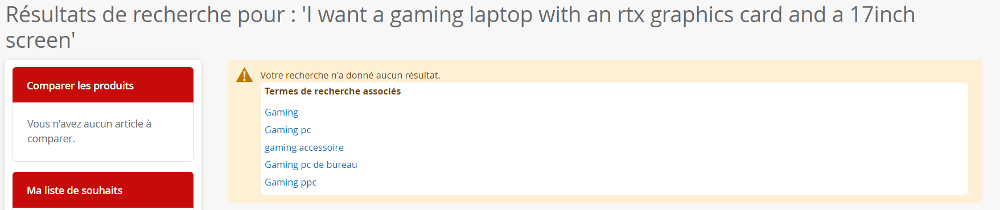
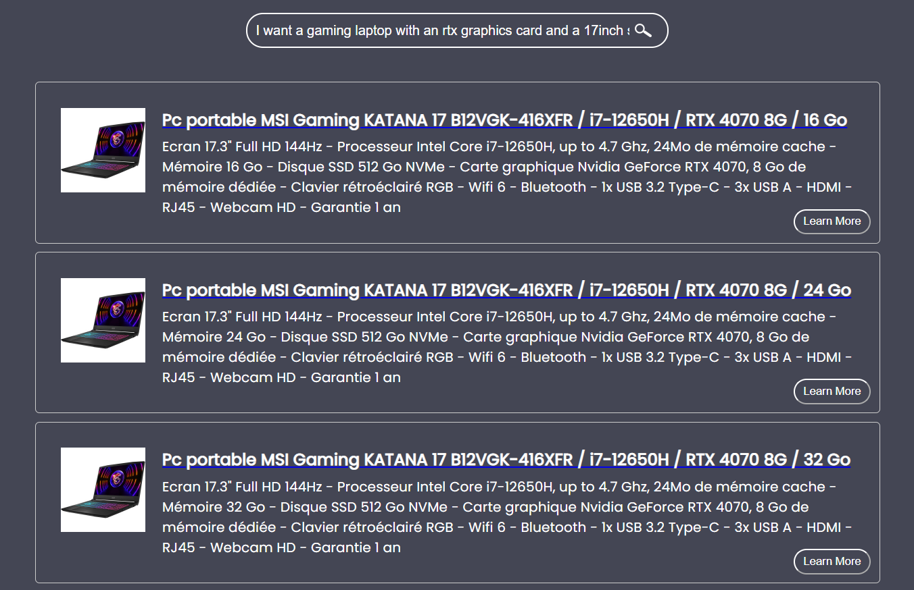
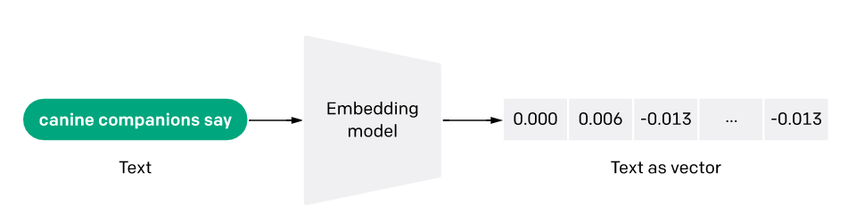
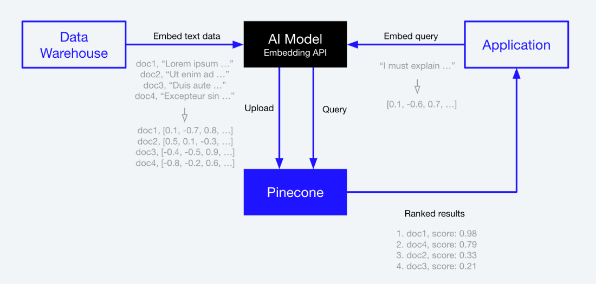

 
###  Introduction

In today's digital age, ecommerce has become a vital part of our daily lives. With the rise of online shopping, customers now have access to an unprecedented amount of products from around the world. However, finding the right product can be a daunting task, especially when faced with a vast amount of search results. Traditional keyword-based search engines often fail to provide relevant results, leaving customers frustrated and unable to find what they're looking for.

To solve this problem, we developed a search engine for ecommerce websites using semantic search. By leveraging the power of openai embeddings and pinecone vector database, we were able to create a search engine that understands the meaning behind the search queries, rather than just matching keywords. This approach not only provides more accurate search results but also improves the overall customer experience.

  

In this article, we will delve into the technical details of the project, including how we implemented the search engine and overcame technical challenges. We will also explore the business plan behind the project, discussing how it can benefit ecommerce websites and their customers, and potential revenue streams. Overall, our aim is to provide insight into the development of the search engine and its potential impact on the ecommerce industry.

###  Semantic Search vs. Keyword-Based Search: What's the Difference?

When we search for something on the internet, we usually type in a few words or phrases that describe what we're looking for. Traditionally, search engines have used these keywords to match them with web pages that contain the same or similar keywords. However, this approach has limitations, as it doesn't always provide accurate or relevant results.

   
  <em>natural language query in ecommerce website </em>

Enter semantic search, a newer approach to search that aims to understand the meaning behind the search query and provide more accurate results. Semantic search uses natural language processing (NLP) techniques to understand the context and intent of the search query, taking into account factors such as synonyms, related concepts, and even user intent. This approach allows the search engine to provide more accurate results that match the user's intent, rather than just the keywords they entered.

   
  <em>natural language query in ecommerce website </em>

So, what's the difference between semantic search and traditional keyword-based search? The main difference is that semantic search aims to understand the meaning behind the search query, while keyword-based search simply matches the keywords with web pages that contain them. This means that semantic search can provide more accurate and relevant results, even when the search query is complex or ambiguous.

For example, if a user searches for "black dress," a keyword-based search engine would return results for web pages that contain the words "black" and "dress," regardless of their relevance or quality. On the other hand, a semantic search engine would understand that the user is looking for a dress that is black in color and provide more relevant results.

Overall, semantic search represents a significant improvement over traditional keyword-based search, providing more accurate and relevant results that better match the user's intent. By leveraging NLP techniques and advanced algorithms, semantic search engines are changing the way we search for information online.

###  Leveraging OpenAI Embeddings and Pinecone Vector Database for Semantic Search

To create our semantic search engine for ecommerce websites, we leveraged the power of openai embeddings and pinecone vector database. These two technologies allowed us to understand the meaning behind search queries and provide more accurate and relevant search results.

   
<em>source: openai.com</em>

OpenAI embeddings are a type of natural language processing technique that maps words and phrases to a high-dimensional vector space. Each word or phrase is represented by a unique vector, which captures its semantic meaning based on its context and relationship to other words and phrases. By using openai embeddings, we were able to understand the meaning behind search queries, even when they were complex or ambiguous.

In our project, we use a vector database to store the embeddings of each product description. A vector database is a type of database that specializes in storing and searching through high-dimensional vectors, such as the embeddings we created using the OpenAI API. Traditional databases are designed to store and retrieve data based on its attributes, such as product name or price. However, vector databases are optimized for finding the most similar vectors to a given query vector, which makes them ideal for semantic search applications. In our project, we use the Pinecone vector database, which is a cloud-based, real-time vector database that allows us to store and search through millions of vectors with sub-second latencies. By using Pinecone, we are able to quickly and accurately match user queries with the most similar product embeddings in our database, allowing us to provide highly relevant search results to our users.

   
  <em>source: pinecone.io</em>

To implement openai embeddings in our search engine, we scraped multiple ecommerce websites to gather data on their products, including the corresponding URLs, descriptions, image URLs, and brands. We saved this data to a CSV file and then used the OpenAI API to transform each product description into embeddings. By transforming the product descriptions into embeddings, we were able to capture the semantic meaning of each description. Then, when a user enters a search query, our search engine uses the OpenAI API to transform the query into an embedding, and then matches it with the most similar product embeddings in our database. This allows us to provide highly relevant search results to the user.

###  Revenue Opportunities for a Semantic Search Engine

There are several potential revenue streams for our search engine project. One option is to charge ecommerce websites a subscription fee to use our search engine on their website. We could offer different pricing tiers based on the size of the website and the number of products they have. Another option is to generate revenue through advertising. We could display targeted ads alongside search results, and charge advertisers based on the number of impressions or clicks their ads receive. Additionally, we could monetize our data by offering insights and analytics to ecommerce websites. By analyzing user search queries and behavior, we could provide valuable insights to ecommerce websites that could help them improve their product offerings and customer experience. Finally, we could explore partnerships with ecommerce websites or other companies that could benefit from our search engine technology. 